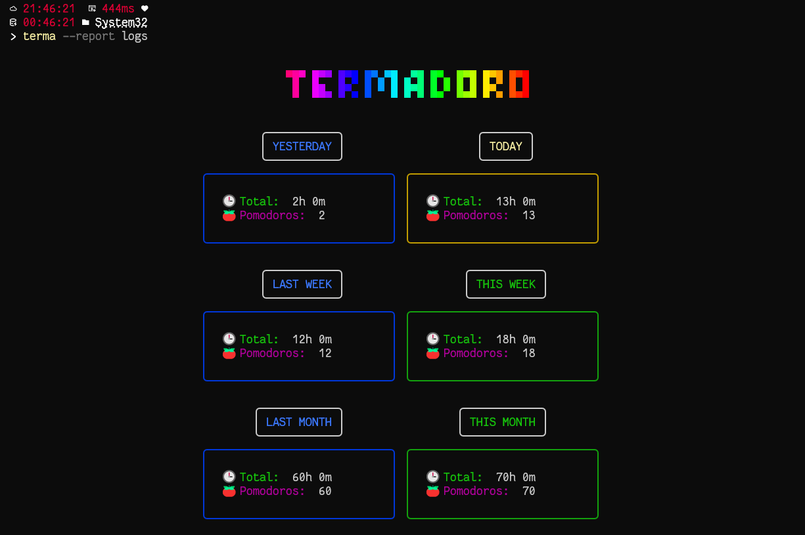
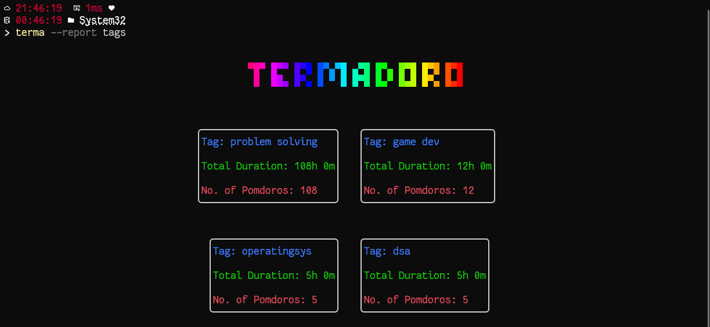
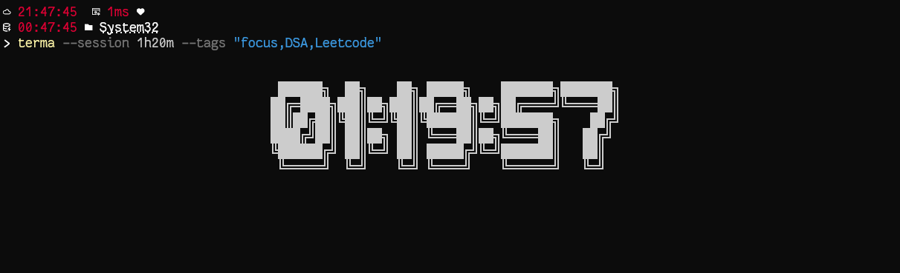
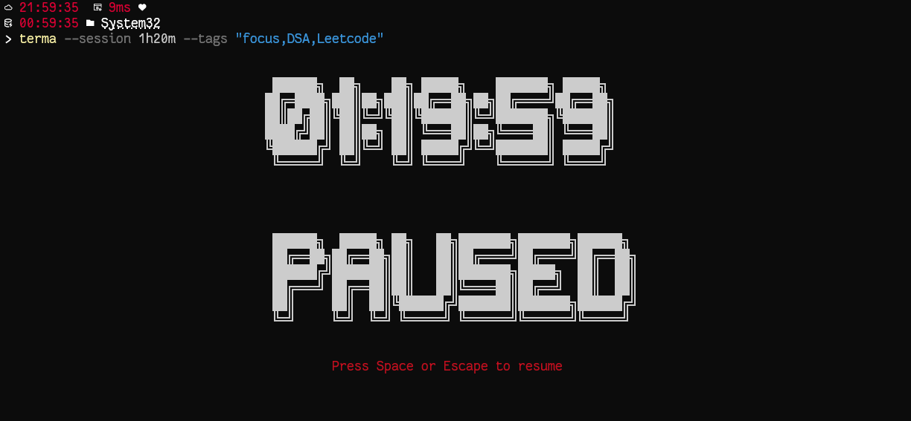
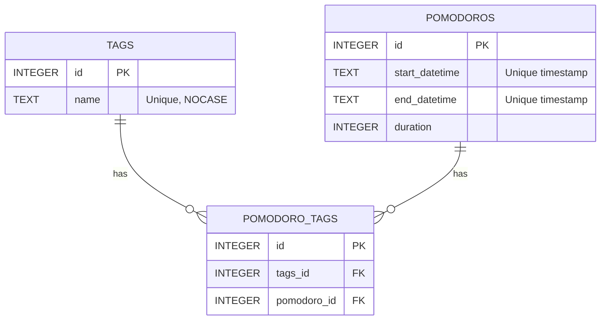

# Termadoro

- A beautiful terminal-based Pomodoro tracker with tag support and real-time reports.


# ✅ Features

- Tag your pomodoro sessions.
- Control the pomodoro timer by pausing/resuming the timer.
- Cross-platform notifications after finishing the session.
- Get a report of your past pomodoro sessions and total durations.
- View a report of your top 6 tags (topics) you've worked on.
--- 
## Install
```bash
$ npm install --global termadoro
```

##  CLI

  ```
	Usage
	  $ terma
	Options
		--name  Your name
        --session Session Length
		--tags 
		--report  <logs , tags>

	Examples
	  $ terma --session 1h20m1s
	  $ terma --session 1h20m1s --tags "focus,deepwork"
	  $ terma --report logs    "Detailed Logs of past pomodoros"
	  $ terma --report tags    "Detailed Logs of past tags and its durations"
  
  NOTE: Any Pomodoro duration less than 10 minutes won't be saved in the log 
```

# 📷 Screenshots
<table>
  <tr>
    <td></td>
    <td></td>
  </tr>
  <tr>
    <td></td>
    <td></td>
  </tr>
</table>

---
# ⚙️ Technologies
1. Ink  + React
2. Nodejs
3. Typescript
3. Sqlite3 
4. Vitest for testing
---

# Dependency
- Sqlite DB

---
# 📝 DB Schema
